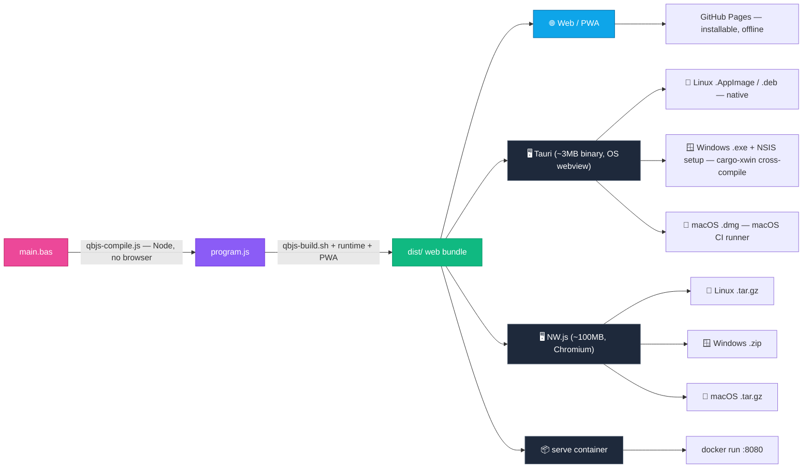

<div align="center">

# 🕹️ QBJS Docker

**Compile [QBJS](https://github.com/boxgaming/qbjs) BASIC into a deployable web app, an installable PWA, a native desktop executable, or a runnable server container — locally or in CI/CD.**

[](../../actions)
[](LICENSE)
[](../../pkgs/container/qbjs-docker)
[](https://github.com/boxgaming/qbjs)

</div>

---

QBJS transpiles QBasic/QB64-style BASIC into **JavaScript** that runs in a browser.
This project wraps QBJS's headless Node compiler in a tiny Docker image plus a set of
GitHub Actions, so you can build **"ready to run"** QBJS apps for every target from a
single `.bas` file — the QBJS counterpart to [`qb64pe-docker`](https://github.com/grymmjack/qb64pe-docker).

> **Why not WebAssembly?** QBJS already emits JavaScript, which browsers run natively —
> there's nothing to "upgrade" to WASM. The modern targets are a **PWA** for the web and
> **Tauri** for a small native exe (the NWJS replacement). See [Architecture](#-architecture).

## ✨ What you get

| Output | How | Result |
|--------|-----|--------|
| 🌐 **Web bundle** | `qbjs-build.sh` | Static site (`dist/`) + **PWA** (installable, offline) → GitHub Pages |
| 🖥️ **Native desktop app** | Tauri (modern) **or** NWJS (legacy) | `.exe`/`.msi`, `.AppImage`/`.deb`, `.dmg` |
| 📦 **Runnable container** | `serve` mode | `docker run -p 8080:8080 my-app` |
| ⚙️ **Just the JS** | `compile` mode | `program.js` for your own hosting |

## 🏗️ Architecture



> **Where each platform builds:** Linux (native), Windows (cross-compiled from Linux via
> `cargo-xwin`), macOS (a `macos-latest` CI runner — Apple's SDK & signing are macOS-only).
> NW.js repackages all three from a single Linux job. The web bundle is universal.

**vs. QB64PE:** QB64PE compiles BASIC → C++ → a native binary (heavy toolchain).
QBJS transpiles BASIC → JS, so this image needs **only Node** — no C/C++ compiler.
One `dist/` bundle then feeds the browser, PWA, Tauri, and NWJS unchanged.

## 🚀 Quick start

### In your QBJS project (recommended)

Add `.github/workflows/build.yml`:

```yaml
name: Build QBJS App
on:
  push:
    branches: [ main ]
    tags: [ 'v*' ]
permissions:
  contents: write      # releases
  pages: write         # GitHub Pages
  id-token: write      # Pages deploy
jobs:
  build:
    uses: grymmjack/qbjs-docker/.github/workflows/reusable-build.yml@main
    with:
      source-file: main.bas
      project-name: My Awesome Game
      # deploy-pages / build-tauri / build-nwjs default to true
```

- Every push builds the **web bundle** and deploys it to **GitHub Pages**.
- Every push builds native **Tauri** installers (Win/macOS/Linux) and **NWJS** packages.
- Push a tag like `v1.0.0` → a **GitHub Release** with every binary attached.

### Locally with Docker

```bash
# Compile + assemble a web bundle
docker run --rm -v "$(pwd):/workspace" \
  ghcr.io/grymmjack/qbjs-docker:main \
  build main.bas --name "My App"

# Serve it
docker run --rm -p 8080:8080 -v "$(pwd)/dist:/app" \
  ghcr.io/grymmjack/qbjs-docker:main serve /app 8080
# → http://localhost:8080
```

Or with Compose:

```bash
docker compose run --rm build workspace/bubble-universe.bas --name "Bubble Universe"
docker compose up serve      # http://localhost:8080
```

### One-command builds with `make`

Every target is a single command (override `SRC=` / `NAME=` as needed):

```bash
make help                                   # list targets
make web   SRC=workspace/bubble-universe.bas NAME="Bubble Universe"   # -> ./dist (web bundle + PWA)
make serve                                  # http://localhost:8080
make tauri NAME="Demo"                      # native desktop app (installs deps, builds)
make nwjs  NAME="Demo"                       # native NW.js packages (Win/macOS/Linux)
make test                                   # end-to-end pipeline check
make clean
```

`make tauri` runs the web build, installs the Linux webview deps (via `make tauri-deps`,
uses `sudo`), scaffolds the Tauri project, and compiles the native binary — no manual steps.
Requires Rust ([rustup.rs](https://rustup.rs)) and Node.

## 🧰 Image commands

| Command | Description |
|---------|-------------|
| `build <src.bas> [--name N] [--mode auto\|play] [--out dir] [--no-pwa]` | Compile + assemble a web bundle |
| `serve [dir] [port]` | Serve a built bundle (default `dist` on `:8080`) |
| `compile <src.bas> <out.js>` | Transpile BASIC → JS only |
| `version` | Print Node + QBJS versions |

`play` mode adds a click-to-start screen (use it for apps that play audio, since browsers
require a user gesture). `auto` runs on load.

## 🖥️ Native desktop builds

Both native paths wrap the **same** `dist/` bundle:

- **Tauri** (`templates/tauri/`) — modern, uses the OS webview. Measured for the demo app:
  **3.4 MB binary**, **1.5 MB** `.deb`/`.rpm`. (A Linux `.AppImage` is ~98 MB because it's
  fully self-contained — it bundles the GTK/WebKit libs; the `.deb`/`.rpm` rely on system
  libs and stay tiny.)
- **NWJS** (`bin/qbjs-nwjs.sh`) — legacy, ~100 MB, bundles Chromium. All three platforms
  are packaged from a single Linux job (it just repackages each platform's NWJS runtime).

Change window title/size/fullscreen in `templates/tauri/src-tauri/tauri.conf.json` or
`templates/nwjs/package.json`.

### Cross-platform targets

| Target | How | Local from Linux? |
|--------|-----|-------------------|
| 🌐 **Web** | `make web` — one bundle runs on every OS/browser | ✅ universal |
| 🐧 **Linux** | `make tauri` (Tauri) / `make nwjs` (NWJS) | ✅ native |
| 🪟 **Windows** | `make tauri-win` — Tauri via [`cargo-xwin`](https://github.com/rust-cross/cargo-xwin), producing a `.exe` + NSIS `-setup.exe` (a `.msi` needs a Windows host → use CI); NWJS via `qbjs-nwjs.sh --platform win` | ✅ cross-compiles |
| 🍎 **macOS** | `make tauri-mac` explains it: **CI only** — Apple's SDK & signing are macOS-only. NWJS `.tar.gz` still cross-packs from Linux. | ⚠️ use CI runner |

**The robust way to get signed installers for all three OSes is the CI matrix** —
[`reusable-build.yml`](.github/workflows/reusable-build.yml) runs Tauri on
`ubuntu-latest` / `macos-latest` / `windows-latest` (native runners), exactly like a
per-OS `build-linux` / `build-macos` / `build-windows` job layout. Push a tag → a Release
with `.AppImage`/`.deb`, `.dmg`, and `.msi`/`.exe`.

```bash
make tauri        # Linux desktop app, here and now
make tauri-win    # Windows .exe/.msi, cross-compiled from Linux
make tauri-all    # Linux + Windows locally (macOS -> CI)
make nwjs         # NWJS packages for Linux + Windows + macOS (repackaged, from Linux)
```

> **Homebrew users:** if `pkg-config` resolves to `/home/linuxbrew/...`, it won't see the
> system GTK/WebKit libs and the Tauri build fails with `gdk-3.0 not found`. `qbjs-tauri.sh`
> handles this automatically by adding the system pkg-config dirs to `PKG_CONFIG_PATH`.

## 📦 Runnable container for your app

Drop [`examples/Dockerfile`](examples/Dockerfile) into your project:

```bash
docker build -t my-qbjs-app .
docker run --rm -p 8080:8080 my-qbjs-app     # → http://localhost:8080
```

## 🔧 The headless compiler (important)

QBJS v0.11.1's stock `qbc.js` has two gaps this project fixes in
[`bin/qbjs-compile.js`](bin/qbjs-compile.js):

1. **Integer division (`\`) crashes it** — the Node runtime `qb-console.js` is missing
   `func_Abs`, which the compiler calls when converting `\`. We patch it onto the Node
   global `QB` at runtime (guarded, so it self-heals when upstream fixes it). No upstream
   file is modified.
2. **It always exits `0`, even on errors** — so a broken build looks green in CI. Our
   wrapper exits non-zero on compile errors. Set `QBJS_STRICT=1` to also fail on warnings.

## ⚙️ Reusable workflow inputs

| Input | Default | Description |
|-------|---------|-------------|
| `source-file` | — | Path to the `.bas` file (required) |
| `project-name` | — | App name / title / artifact names (required) |
| `mode` | `auto` | `auto` or `play` loader |
| `qbjs-ref` | `main` | QBJS git ref (branch/tag/commit) to build with |
| `deploy-pages` | `true` | Deploy web bundle to GitHub Pages |
| `build-tauri` | `true` | Build native Tauri installers |
| `build-nwjs` | `true` | Build native NWJS packages |
| `nwjs-version` | `0.95.0` | NWJS runtime version |
| `tauri-identifier` | `org.qbjs.<slug>` | Reverse-domain app id |

## 🗂️ Project structure

```
qbjs-docker/
├── Dockerfile                 # Node-based toolchain image (multi-stage)
├── docker-compose.yml
├── action.yml                 # Composite action: build web bundle
├── bin/
│   ├── qbjs-compile.js        # Hardened headless compiler (the fix)
│   ├── qbjs-build.sh          # BASIC -> deployable web bundle (+ PWA)
│   ├── qbjs-serve.js          # Tiny static server (serve mode)
│   ├── qbjs-nwjs.sh           # NWJS packager (all platforms from Linux)
│   └── entrypoint.sh          # build | serve | compile dispatcher
├── templates/
│   ├── index.auto.html / index.play.html   # loaders
│   ├── manifest.json / service-worker.js   # PWA
│   ├── tauri/                 # Tauri v2 wrapper
│   └── nwjs/                  # NWJS manifest
├── examples/Dockerfile        # runnable app container
├── workspace/                 # sample programs
└── .github/workflows/         # docker-build, reusable-build, test, example
```

## 🔗 Related

- [QBJS](https://github.com/boxgaming/qbjs) · [QBJS Web IDE](https://qbjs.org) · [QBJS Wiki](https://github.com/boxgaming/qbjs/wiki)
- [qb64pe-docker](https://github.com/grymmjack/qb64pe-docker) — the same idea for QB64PE native builds
- [Tauri](https://tauri.app) · [NW.js](https://nwjs.io)

## License

MIT — see [LICENSE](LICENSE). QBJS is © boxgaming under its own license.

---

<div align="center">Made with ❤️ for the QB/QBasic community</div>
