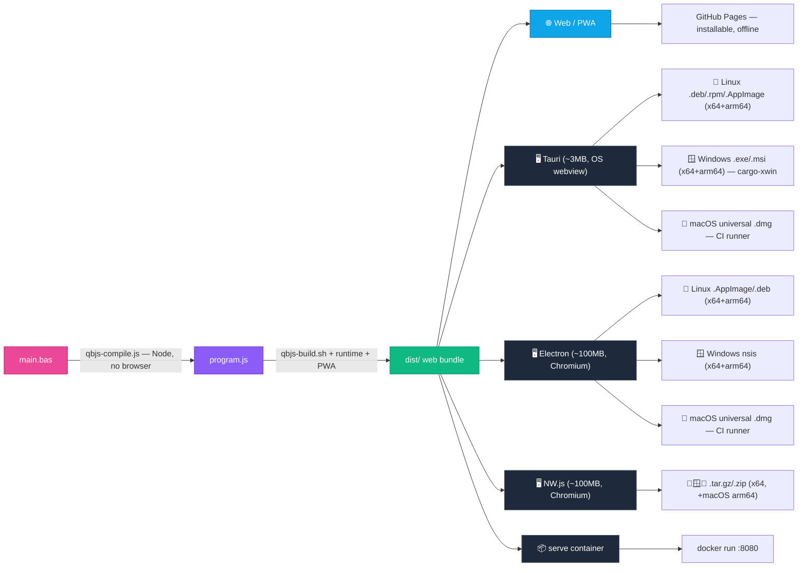

<div align="center">

# 🕹️ QBJS Docker

**Compile [QBJS](https://github.com/boxgaming/qbjs) BASIC into a deployable web app, an installable PWA, a native desktop executable, or a runnable server container — locally or in CI/CD.**

[](../../actions)
[](LICENSE)
[](../../pkgs/container/qbjs-docker)
[](https://github.com/boxgaming/qbjs)

</div>

---

QBJS transpiles QBasic/QB64-style BASIC into **JavaScript** that runs in a browser.
This project wraps QBJS's headless Node compiler in a tiny Docker image plus a set of
GitHub Actions, so you can build **"ready to run"** QBJS apps for every target from a
single `.bas` file — the QBJS counterpart to [`qb64pe-docker`](https://github.com/grymmjack/qb64pe-docker).

> **Why not WebAssembly?** QBJS already emits JavaScript, which browsers run natively —
> there's nothing to "upgrade" to WASM. The modern targets are a **PWA** for the web and
> **Tauri** for a small native exe (the NWJS replacement). See [Architecture](#-architecture).

## ✨ What you get

| Output | How | Result |
|--------|-----|--------|
| 🌐 **Web bundle** | `qbjs-build.sh` | Static site (`dist/`) + **PWA** (installable, offline) → GitHub Pages |
| 🖥️ **Native desktop app** | **Tauri** (tiny native), **Electron** (bundled Chromium), or NWJS (legacy) | `.exe`/`.msi`, `.AppImage`/`.deb`, `.dmg` |
| 📦 **Runnable container** | `serve` mode | `docker run -p 8080:8080 my-app` |
| ⚙️ **Just the JS** | `compile` mode | `program.js` for your own hosting |

## 🏗️ Architecture



> **Where each platform builds:** Linux (native), Windows (cross-compiled from Linux via
> `cargo-xwin`), macOS (a `macos-latest` CI runner — Apple's SDK & signing are macOS-only).
> NW.js repackages all three from a single Linux job. The web bundle is universal.

**vs. QB64PE:** QB64PE compiles BASIC → C++ → a native binary (heavy toolchain).
QBJS transpiles BASIC → JS, so this image needs **only Node** — no C/C++ compiler.
One `dist/` bundle then feeds the browser, PWA, Tauri, and NWJS unchanged.

## 🚀 Quick start

### In your QBJS project (recommended)

Add `.github/workflows/build.yml`:

```yaml
name: Build QBJS App
on:
  push:
    branches: [ main ]
    tags: [ 'v*' ]
permissions:
  contents: write      # releases
  pages: write         # GitHub Pages
  id-token: write      # Pages deploy
  packages: read       # pull the toolchain image from GHCR
jobs:
  build:
    uses: grymmjack/qbjs-docker/.github/workflows/reusable-build.yml@main
    with:
      source-file: main.bas
      project-name: My Awesome Game
      # deploy-pages / build-tauri / build-nwjs default to true
```

- Every push builds the **web bundle** and deploys it to **GitHub Pages**.
- Every push builds native **Tauri** installers (Win/macOS/Linux) and **NWJS** packages.
- Push a tag like `v1.0.0` → a **GitHub Release** with every binary attached.

### Locally with Docker

```bash
# Compile + assemble a web bundle
docker run --rm -v "$(pwd):/workspace" \
  ghcr.io/grymmjack/qbjs-docker:main \
  build main.bas --name "My App"

# Serve it
docker run --rm -p 8080:8080 -v "$(pwd)/dist:/app" \
  ghcr.io/grymmjack/qbjs-docker:main serve /app 8080
# → http://localhost:8080
```

Or with Compose:

```bash
docker compose run --rm build workspace/bubble-universe.bas --name "Bubble Universe"
docker compose up serve      # http://localhost:8080
```

### One-command builds with `make`

Every target is a single command. Override `SRC=` / `NAME=` as needed
(e.g. `make electron SRC=workspace/bubble-universe.bas NAME="Bubble Universe"`).

**Build & serve**

| Target | Description |
|--------|-------------|
| `make image` (`build`) | Build the Docker toolchain image |
| `make web` | Compile `SRC` → web bundle + PWA → `./dist` |
| `make serve` | Serve the bundle at `http://localhost:8080` |
| `make compile` | Transpile `SRC` → JavaScript only |
| `make demo` | Build the sample and serve it |

**Native desktop — Tauri** (tiny, OS webview)

| Target | Description |
|--------|-------------|
| `make tauri` | Tauri app for this OS (Linux) → `./tauri-app` |
| `make tauri-win` / `tauri-win-arm` | Windows x64 / ARM64 via cargo-xwin |
| `make tauri-mac` | macOS (explains: build on a Mac / CI) |
| `make tauri-all` | Linux + Windows Tauri |
| `make tauri-deps` / `tauri-win-deps` | Install system deps (uses `sudo`) |

**Native desktop — Electron** (bundled Chromium, best installers)

| Target | Description |
|--------|-------------|
| `make electron` | Linux x64 + arm64 (AppImage + deb) → `./electron-app/release` |
| `make electron-win` | Windows nsis (needs `wine` locally) |
| `make electron-mac` | macOS (explains: build on a Mac / CI) |

**Native desktop — NW.js** (bundled Chromium, legacy)

| Target | Description |
|--------|-------------|
| `make nwjs` | x64 packages (Linux/macOS/Windows) → `./out` |
| `make nwjs-arm` | arm64 packages (macOS only upstream) |

**Run & reveal builds**

| Target | Description |
|--------|-------------|
| `make run-tauri` / `run-electron` / `run-nwjs-linux` | Launch a built Linux app |
| `make run-tauri-win` / `run-nwjs-win` | Launch a Windows build via wine |
| `make open-tauri` / `open-electron` / `open-nwjs` / `open-dist` | Reveal outputs in your file manager |
| `make webview2-wine` | (experimental) install WebView2 into your wine prefix |

**Everything & maintenance**

| Target | Description |
|--------|-------------|
| `make all` | Everything buildable on this host (macOS → CI) |
| `make test` | End-to-end pipeline check |
| `make clean` / `clean-docker` | Remove build artifacts / the Docker image |
| `make push` | Tag & push the image to GHCR |

`make tauri`/`make electron` run the web build first, install their deps, scaffold the
project, and build — no manual steps. Tauri needs Rust ([rustup.rs](https://rustup.rs)) + Node;
Electron needs Node.

## 🧰 Image commands

| Command | Description |
|---------|-------------|
| `build <src.bas> [--name N] [--mode auto\|play] [--out dir] [--no-pwa]` | Compile + assemble a web bundle |
| `serve [dir] [port]` | Serve a built bundle (default `dist` on `:8080`) |
| `compile <src.bas> <out.js>` | Transpile BASIC → JS only |
| `version` | Print Node + QBJS versions |

`play` mode adds a click-to-start screen (use it for apps that play audio, since browsers
require a user gesture). `auto` runs on load.

## 🖥️ Native desktop builds

All three native paths wrap the **same** `dist/` bundle — pick by trade-off:

| | Size | Rendering | Tooling | Best for |
|---|------|-----------|---------|----------|
| **Tauri** (`make tauri`) | **~3 MB** binary | OS webview (varies by OS) | Rust + Tauri CLI | smallest native app |
| **Electron** (`make electron`) | ~100 MB | bundled Chromium (consistent) | **electron-builder** (installers, auto-update, signing) | robust distribution, familiar tooling |
| **NWJS** (`make nwjs`) | ~100 MB | bundled Chromium | DIY | legacy / simplest |

- **Tauri** (`templates/tauri/`) — measured for the demo: **3.4 MB binary**, **1.5 MB** `.deb`/`.rpm`
  (a Linux `.AppImage` is ~98 MB, self-contained). Compiles Rust per arch.
- **Electron** (`templates/electron/`) — `electron-builder` with the same config shape as a
  typical Electron app. Cross-**arch** is free (repackages prebuilt runtimes): one Linux run
  makes AppImage + deb for **x64 and arm64**. Best installers + auto-update path.
- **NWJS** (`bin/qbjs-nwjs.sh`) — repackages each platform's NWJS runtime from one Linux job.

Change the window title/size in `templates/tauri/src-tauri/tauri.conf.json`,
`templates/electron/main.js`, or `templates/nwjs/package.json`.

### Cross-platform targets (x64 + ARM64)

The CI matrix ([`reusable-build.yml`](.github/workflows/reusable-build.yml)) builds every
OS **and** architecture on a tag push:

| OS | Arch | Tauri | NW.js | Where |
|----|------|-------|-------|-------|
| 🐧 Linux | x64 | `.deb` `.rpm` `.AppImage` | `.tar.gz` | `ubuntu` runner / local |
| 🐧 Linux | **arm64** | `.deb` `.rpm` `.AppImage` | — ¹ | `ubuntu-24.04-arm` runner |
| 🍎 macOS | **universal** (Intel + Apple Silicon) | `_universal.dmg` | x64 + arm64 `.tar.gz` | `macos` runner |
| 🪟 Windows | x64 | `-setup.exe` + `.msi` | `.zip` | `windows` runner / local |
| 🪟 Windows | **arm64** | `-setup.exe` | — ¹ | cargo-xwin (Linux) |

¹ NW.js only publishes an ARM64 runtime for **macOS** — there's no upstream `linux-arm64`
or `win-arm64` NW.js build, so ARM Linux/Windows are Tauri-only. The packager skips
unavailable arch/OS combos automatically.

Locally on an x86 Linux box you can build everything except native macOS and Linux-ARM64:

```bash
make tauri          # Tauri Linux x64
make tauri-win      # Tauri Windows x64  (cargo-xwin)
make tauri-win-arm  # Tauri Windows ARM64 (cargo-xwin)
make electron       # Electron Linux x64 + arm64 (AppImage + deb)
make electron-win   # Electron Windows (needs wine)
make nwjs           # NW.js x64  (Linux/macOS/Windows)
make nwjs-arm       # NW.js ARM64 (macOS only upstream)
make all            # everything buildable here; macOS -> CI
```

> **`aarch64` = Apple Silicon.** The macOS build is **universal**, so one `.dmg` runs on
> both Intel and Apple Silicon — no separate Intel build needed.
>
> **macOS "app is damaged"?** These are ad-hoc signed but not notarized. Right-click the
> app → **Open**, or clear quarantine: `xattr -cr "/Applications/Your App.app"`. (Ad-hoc
> signing is what keeps Apple Silicon builds from being rejected outright.)
>
> **ARM Linux runners** are free for public repos; private repos need a paid plan for
> `ubuntu-24.04-arm` (that one matrix leg will queue/fail until the repo is public).

> **Homebrew users:** if `pkg-config` resolves to `/home/linuxbrew/...`, it won't see the
> system GTK/WebKit libs and the Tauri build fails with `gdk-3.0 not found`. `qbjs-tauri.sh`
> handles this automatically by adding the system pkg-config dirs to `PKG_CONFIG_PATH`.

### Running & revealing your builds

```bash
make run-tauri          # run the Linux Tauri app
make run-electron       # run the Linux Electron app (AppImage)
make run-tauri-win      # run the Windows .exe (via wine; see WebView2 note below)
make run-nwjs-linux     # extract + run the Linux NW.js package
make run-nwjs-win       # run the Windows NW.js package under wine (self-contained)
make open-tauri         # reveal the Linux installers in your file manager
make open-tauri-win     # reveal the Windows installers
make open-nwjs / open-dist
```

> **Windows + WebView2.** Tauri uses the OS webview — **WebView2** on Windows. Windows 11
> and updated Windows 10 ship it, so the `.exe` just works there; the `-setup.exe` installer
> bootstraps it on older systems (`webviewInstallMode: downloadBootstrapper`). Under **wine**
> WebView2 is usually absent, so `make run-tauri-win` may error `Could not find the WebView2
> Runtime`. That's a wine limitation, not a build defect. Try `make webview2-wine`
> (experimental), test on real Windows/a VM, or run the **NW.js** Windows build instead —
> `make run-nwjs-win` — which bundles Chromium and needs no WebView2.

## 📦 Runnable container for your app

Drop [`examples/Dockerfile`](examples/Dockerfile) into your project:

```bash
docker build -t my-qbjs-app .
docker run --rm -p 8080:8080 my-qbjs-app     # → http://localhost:8080
```

## 🔧 The headless compiler (important)

QBJS v0.11.1's stock `qbc.js` has two gaps this project fixes in
[`bin/qbjs-compile.js`](bin/qbjs-compile.js):

1. **Integer division (`\`) crashes it** — the Node runtime `qb-console.js` is missing
   `func_Abs`, which the compiler calls when converting `\`. We patch it onto the Node
   global `QB` at runtime (guarded, so it self-heals when upstream fixes it). No upstream
   file is modified.
2. **It always exits `0`, even on errors** — so a broken build looks green in CI. Our
   wrapper exits non-zero on compile errors. Set `QBJS_STRICT=1` to also fail on warnings.

## ⚙️ Reusable workflow inputs

| Input | Default | Description |
|-------|---------|-------------|
| `source-file` | — | Path to the `.bas` file (required) |
| `project-name` | — | App name / title / artifact names (required) |
| `mode` | `auto` | `auto` or `play` loader |
| `qbjs-ref` | `main` | QBJS git ref (branch/tag/commit) to build with |
| `deploy-pages` | `true` | Deploy web bundle to GitHub Pages |
| `build-tauri` | `true` | Build native Tauri installers |
| `build-nwjs` | `true` | Build native NWJS packages |
| `nwjs-version` | `0.95.0` | NWJS runtime version |
| `tauri-identifier` | `org.qbjs.<slug>` | Reverse-domain app id |

## 🗂️ Project structure

```
qbjs-docker/
├── Dockerfile                 # Node-based toolchain image (multi-stage)
├── docker-compose.yml
├── action.yml                 # Composite action: build web bundle
├── bin/
│   ├── qbjs-compile.js        # Hardened headless compiler (the fix)
│   ├── qbjs-build.sh          # BASIC -> deployable web bundle (+ PWA)
│   ├── qbjs-serve.js          # Tiny static server (serve mode)
│   ├── qbjs-nwjs.sh           # NWJS packager (all platforms from Linux)
│   └── entrypoint.sh          # build | serve | compile dispatcher
├── templates/
│   ├── index.auto.html / index.play.html   # loaders
│   ├── manifest.json / service-worker.js   # PWA
│   ├── tauri/                 # Tauri v2 wrapper
│   └── nwjs/                  # NWJS manifest
├── examples/Dockerfile        # runnable app container
├── workspace/                 # sample programs
└── .github/workflows/         # docker-build, reusable-build, test, example
```

## 🔗 Related

- [QBJS](https://github.com/boxgaming/qbjs) · [QBJS Web IDE](https://qbjs.org) · [QBJS Wiki](https://github.com/boxgaming/qbjs/wiki)
- [qb64pe-docker](https://github.com/grymmjack/qb64pe-docker) — the same idea for QB64PE native builds
- [Tauri](https://tauri.app) · [NW.js](https://nwjs.io)

## License

MIT — see [LICENSE](LICENSE). QBJS is © boxgaming under its own license.

---

<div align="center">Made with ❤️ for the QB/QBasic community</div>
